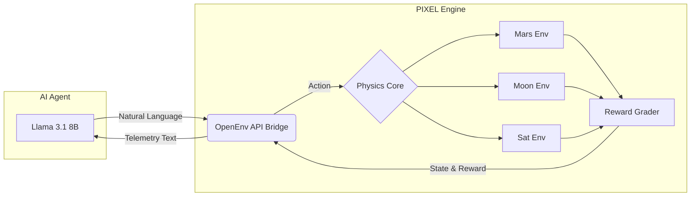

<div align="center">
  

  # 🔴 PIXEL: Autonomous Space Agent Framework
  
  <h3>Teaching AI to survive Mars dust storms, freezing Lunar nights, and orbital traffic jams.</h3>

  <p>
    <a href="https://huggingface.co/spaces/satyampy/Pixie"></a>
    <a href="https://hub.docker.com/r/satyamgpy/pixel-env"></a>
    
    
  </p>
</div>

<br>

## 🌌 Overview

Current space exploration relies on rigid, hardcoded rules. When a rover on Mars encounters a dust storm, it enters "Safe Mode" and waits 20+ minutes for Earth's instructions. In an emergency, this delay is fatal.

**PIXEL** solves this by bridging **Large Language Models** with **Reinforcement Learning**. We built an `openenv-core` compliant physics and logic engine that simulates three extreme environments. Using **GRPO** (Group Relative Policy Optimization), we successfully trained an LLM to override standard instructions, manage battery life, and survive autonomously.

---

## 🚀 The Three Environments

| Environment | Constraint | Agent Objective |
| :--- | :--- | :--- |
| 🔴 **Mars Rover** | **Communication Delay** | Survive 100 Sols. Balance science collection with battery management. Seek shelter during sudden dust storms instead of waiting for Earth commands. |
| 🌕 **Moon Rover** | **Extreme Thermal Cycles** | Operate during the 14-day Lunar light cycle. Anticipate the -130°C Lunar night and enter hibernation mode to prevent hardware failure. |
| 🛰️ **Sat-Constellation** | **Multi-Agent Traffic** | Manage an orbital network (Comm, Imaging, Relay). Prevent data-buffer overflows and maneuver to avoid Kessler-syndrome debris collisions. |

---

## 🏗️ Technical Architecture

PIXEL is a fully decoupled, production-ready full-stack application:

1. **The Environment (Python/FastAPI):** An OpenEnv compliant backend that manages the physics, weather generation, battery depletion, and reward calculations.
2. **The LLM (Llama 3.1 8B):** Quantized to 4-bit and trained via `unsloth` and `trl` using the GRPO reinforcement learning pipeline.
3. **The UI (React/Vite):** A stunning, dark-mode Mission Control dashboard to view live telemetry and interact with the AI agent.



*(Note: If the diagram above does not render in your markdown viewer, it represents the cyclic data flow from the LLM, through the OpenEnv standard `step()` function, into the physics/reward engines, and back as text.)*

---

## 🧠 Reinforcement Learning (GRPO)

We abandoned standard Supervised Fine-Tuning (SFT) in favor of **GRPO**.

### The Training Loop:
1. **Prompt Generation:** The environment outputs: *"Sol 12. Battery 45%. Dust storm approaching."*
2. **Exploration:** The LLM generates **4 different** actions.
3. **Evaluation:** PIXEL runs all 4 actions and assigns scores:
   - 🟢 `+1.0` (Valid Science)
   - 🔴 `-1.0` (Wasted Battery)
   - 💀 `-5.0` (Fatal Hardware Damage)
4. **Optimization:** The model updates its LoRA weights to maximize the highest-scoring reasoning path.

---

## 💻 Quick Start & Deployment

PIXEL is fully containerized and hosted on the HuggingFace Spaces Docker infrastructure. 

### Run Locally via Docker
```bash
docker pull satyamgpy/pixel-env:latest
docker run -p 7860:7860 satyamgpy/pixel-env:latest
```

### Accessing the Dashboard
Once the container is running (locally or on HuggingFace), navigate to:
* **Mission Dashboard:** `http://localhost:7860/health`
* **Swagger API Docs:** `http://localhost:7860/docs`

---

## 📡 OpenEnv API Standard

PIXEL complies exactly with the OpenEnv specification, meaning any RL framework can plug into it instantly.

**`POST /reset/{task_id}`**
* `task_id`: mars, moon, or easy
* *Returns the starting textual observation.*

**`POST /step/{task_id}`**
* Payload: `{"action": "Hibernate to save power"}`
* *Returns the next observation, float reward, and done status.*

---
<div align="center">
  <b>Developed for the OpenEnv Hackathon 2025</b>
</div>
