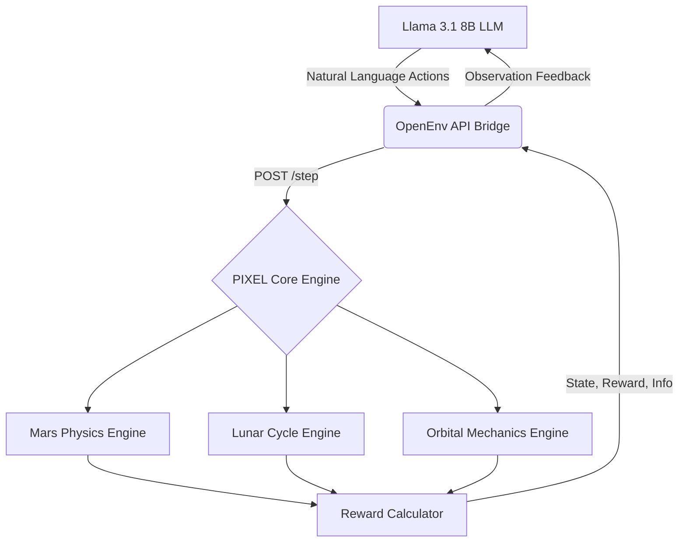

<div align="center">
  
  
  # 🔴 PIXEL: Autonomous Space Agent Framework 🚀

  <p><em>A production-ready OpenEnv simulation for training LLM agents in deep-space environments using GRPO Reinforcement Learning.</em></p>
  <p>
    <a href="https://huggingface.co/spaces/satyampy/Pixie"></a>
    <a href="https://hub.docker.com/r/satyamgpy/pixel-env"></a>
  </p>
  <p>
    
    
    
    
  </p>
</div>

---

## 🛑 The Autonomy Bottleneck

**Current space exploration autonomy is dangerously rigid.** 
When a Mars rover encounters a severe dust storm, or a Moon rover faces an unexpected temperature drop, hardcoded legacy systems trigger "Safe Mode" and wait for Earth to intervene. 

* On **Mars**, communication takes 20 minutes. A late decision can result in a total loss of the vehicle.
* On the **Moon**, nightfall plunges temperatures to -130°C. Missing a hibernation window is fatal.
* In **Orbit**, satellite networks must dynamically balance bandwidth, battery, and orbital collision risks.

**We need agents, not algorithms.** We need AI that can adapt, reason, and survive.

---

## 💡 The PIXEL Solution

**PIXEL** is a multi-environment Reinforcement Learning suite that leverages the **OpenEnv standard** to train Large Language Models (LLMs) to master complex spatial-temporal domains:

1. 🔴 **Mars Rover Env:** Deep autonomy constraint modeling. The agent must learn to **override** commands from Earth when local weather or hardware anomalies threaten its survival.
2. 🌕 **Moon Rover Env:** Extreme cyclical survival. The agent must optimize scientific gathering during the 14-sol day, and proactively hibernate before the freezing lunar night.
3. 🛰️ **Satellite Network Env:** Multi-agent coordination. The agent governs an orbital constellation to prevent data buffer overflows and avoid Kessler-syndrome collisions.

---

## 🏗️ System Architecture

PIXEL is built with a decoupled, production-grade architecture:



---

## 🧠 Reinforcement Learning (GRPO)

PIXEL was used to train a `Llama 3.1 8B Instruct` model using **Group Relative Policy Optimization (GRPO)**. 

### How the Model Learns
1. **Observation:** The environment feeds the LLM a plain-text telemetry readout. *(e.g., "Sol 12. Battery 45%. Dust storm approaching.")*
2. **Exploration (GRPO):** Instead of one answer, the LLM generates 4 different strategic actions.
3. **Reward Function:** PIXEL grades all 4 actions through a multi-axis rubric:
   * `+1.0` for valid scientific data collection.
   * `+2.0` for successful orbital data transmission.
   * `-1.0` for battery wastage on redundant tasks.
   * `-5.0` (Fatal) if the vehicle runs out of power.
4. **Optimization:** The model updates its neural weights to heavily favor the thought process that led to the highest relative reward.

---

## 🚀 Quick Start (Docker)

PIXEL is fully containerized and available on Docker Hub. You can spin up the complete API and mission dashboard locally in seconds.

```bash
# Pull and run the latest image
docker run -p 7860:7860 satyamgpy/pixel-env:latest
```

Once running, navigate to:
- 🌐 **Mission Dashboard:** `http://localhost:7860/health`
- 📄 **Swagger API Docs:** `http://localhost:7860/docs`

---

## 📡 API Reference (OpenEnv Standard)

PIXEL natively implements the `openenv-core` interface, making it universally plug-and-play with any standard RL framework.

### `POST /reset/{task_id}`
Initializes the simulation environment.
* **`task_id` options:** `mars`, `moon`, `easy`
* **Returns:** Initial observation text.

### `POST /step/{task_id}`
Executes an agent action in the environment.
* **Payload:** `{"action": "Drive to sector 4 and drill"}`
* **Returns:** `observation`, `reward` (float), `done` (boolean), `info` (dict).

### `GET /state`
Returns raw JSON telemetry of the current active environment without advancing the simulation.

---

<div align="center">
  <b>Built for the OpenEnv Hackathon 2025</b>
</div>
