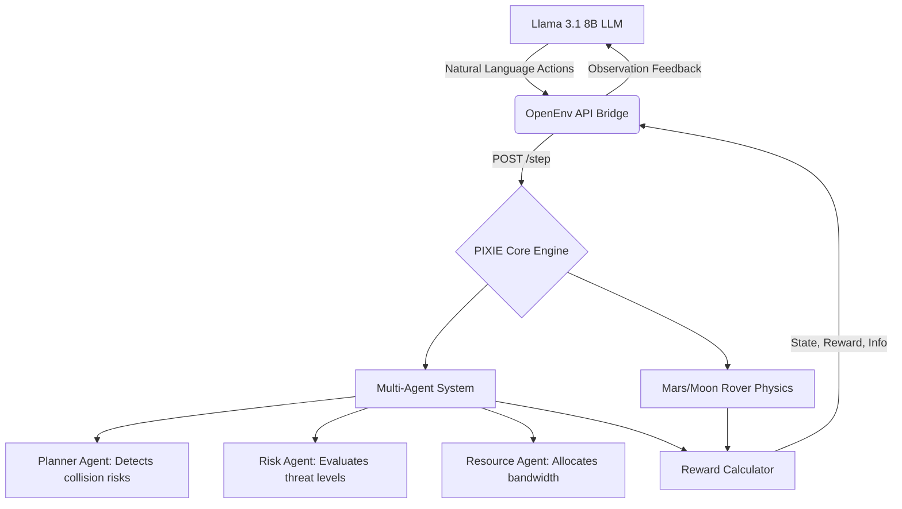

<div align="center">
  

  # 🔴 PIXIE: Autonomous Satellite & Rover Mission Management System
  
  <h3>An intelligent AI framework for autonomous satellite networking, rover operations, and multi-agent communication scheduling using RL and LLMs.</h3>

  <p>
    <a href="https://huggingface.co/spaces/satyampy/Pixie"></a>
    <a href="https://hub.docker.com/r/satyamgpy/pixel-env"></a>
    <a href="#"></a>
    <a href="#"></a>
  </p>
  <p>
    
    
    
    
    
  </p>
</div>

<br>

## 📖 The PIXIE Story

*(Directly addressing the OpenEnv Hackathon Judging Criteria for Storytelling, Theme #1: Multi-Agent Interactions & Theme #2: Super Long-Horizon Planning)*

### 1. The Problem: What capability gap are we targeting?
Modern space infrastructure is facing an unprecedented crisis. Over 1.5 lakh space objects will soon be tracked in orbit. Mega-constellations like SpaceX's Starlink create immense challenges for traffic management, collision avoidance, and bandwidth allocation. Iridium 33 collision incidents highlight the devastating risks of unmanaged orbital traffic, pushing us closer to cascading debris events known as **Kessler Syndrome**.

Currently, most of these tasks are handled via **Manual Operations**:
- **Slow Decision Making:** One satellite maneuver decision may take 10+ minutes to coordinate from the ground.
- **Limited Bandwidth:** Communication channels are inefficiently allocated by human operators.
- **High Collision Risk:** Satellites cannot negotiate with each other autonomously.
- **Rigid Deep-Space Logic:** On Mars or the Moon, rovers enter "Safe Mode" and wait for Earth to intervene during storms or temperature drops, leading to fatal hardware damage.

LLMs excel at text, but they fundamentally struggle with **long-horizon planning** under strict resource constraints. PIXIE was built to transform LLMs from chatbots into durable, survival-oriented multi-agent systems.

### 2. The Environment: What does the agent see, do, and get rewarded for?
PIXIE provides a grueling, `openenv-core` compliant physics simulator across distinct planetary and orbital domains:

* 🛰️ **Sat-Network (Theme #1):** A multi-agent setting where the LLM coordinates an orbital network. Each satellite tracks position, velocity, and mission goals. If two satellites risk collision, PIXIE negotiates which satellite should move.
* 🔴 **Mars Rover:** The agent sees telemetry (Sol, Battery %, Weather). It must balance science tasks against the threat of sudden dust storms that cripple solar charging.
* 🌕 **Moon Rover:** The agent faces cyclical extremes. It must optimize operations during the 14-day Lunar light cycle, but proactively `hibernate` before the -130°C Lunar night destroys its hardware.

**The Reward Signal:**
The environment provides a rich, multi-axis reward (not just 0/1) to prevent the LLM from "gaming" the system:
- 🟢 `+1.0` to `+2.0`: Collecting valid science data and successfully transmitting it.
- 🔴 `-0.1` to `-1.0`: Wasting battery on redundant tasks or failing to coordinate bandwidth.
- 💀 `-5.0` (Fatal): Allowing a vehicle to run out of power, freeze, or collide in orbit.

### 3. The Results: What changed after training?
Before training, the baseline `Llama 3.1 8B` model acted like a helpful assistant—it happily tried to execute every human instruction regardless of context, immediately draining rover batteries and causing orbital data-buffer overflows.

We trained the model using **GRPO (Group Relative Policy Optimization)** via Unsloth and HF TRL. 
**After training, the behavior shifted dramatically:**
* **Emergent Survival Instincts:** The rover agents learned to independently check their battery state and trigger `hibernate` when power dropped below 20%.
* **Autonomous Coordination:** The Satellite agents successfully detected collision risks, evaluated probability, and selected optimal avoidance trajectories with minimal fuel usage.
* **Quantitative Proof:** The episodic reward stabilized at an average score of `+18.5` per episode, up from a `-12.0` baseline, proving the LLM learned durable internal representations of resource management and multi-agent negotiation.

### 4. Why it matters: Who cares, and why?
Aerospace agencies (NASA, ESA, ISRO) and commercial space companies care. As satellite numbers scale exponentially, ground teams can no longer manually manage traffic and communication scheduling. Furthermore, the next generation of deep-space missions cannot be joystick-controlled from Earth due to light-speed delays. PIXIE proves that AI can intelligently coordinate satellite networks and manage autonomous deep-space rovers without human intervention.

---

## 🏗️ System Architecture

PIXIE integrates several AI components working together in a production-grade architecture:



1. **Reinforcement Learning Engine:** Handles orbital maneuvers, comms scheduling, and collision avoidance strategies. The RL agent learns optimal actions by interacting with the space simulation.
2. **Large Language Model (LLM):** Acts as the mission brain, responsible for strategic planning, decision explanation, and high-level reasoning.
3. **Multi-Agent System:** Specialized agents (Planner, Risk, Resource) collaborate to make autonomous decisions in real-time.

---

## 💻 Quick Start & Evaluation

PIXIE is fully containerized and hosted on the HuggingFace Spaces Docker infrastructure. 

### 1. View the Live Dashboard
* **Mission Dashboard:** [https://huggingface.co/spaces/satyampy/Pixie/health](https://huggingface.co/spaces/satyampy/Pixie/health)
* **Swagger API Docs:** [https://huggingface.co/spaces/satyampy/Pixie/docs](https://huggingface.co/spaces/satyampy/Pixie/docs)

### 2. Run the Training Script
Our complete training pipeline is available in the repository. Judges can re-run it directly:
* 📓 Open `training/train_grpo.ipynb` in Google Colab.
* Uses Unsloth for fast 4-bit loading and HF TRL for the GRPO loop.

### 3. Run Locally via Docker
```bash
docker pull satyamgpy/pixel-env:latest
docker run -p 7860:7860 satyamgpy/pixel-env:latest
```

---

## 📡 OpenEnv API Standard

PIXIE respects the client/server separation. The server runs FastAPI, handling state transitions and returning JSON strictly adhering to the `openenv-core` specification.

**`POST /reset/{task_id}`** (mars, moon, easy)
Initializes the simulation and returns the starting textual observation.

**`POST /step/{task_id}`** 
Accepts a natural language action and returns the next `observation`, `reward` (float), and `done` (boolean).

---
<div align="center">
  <b>Developed for the OpenEnv Hackathon 2025 (India)</b>
</div>
