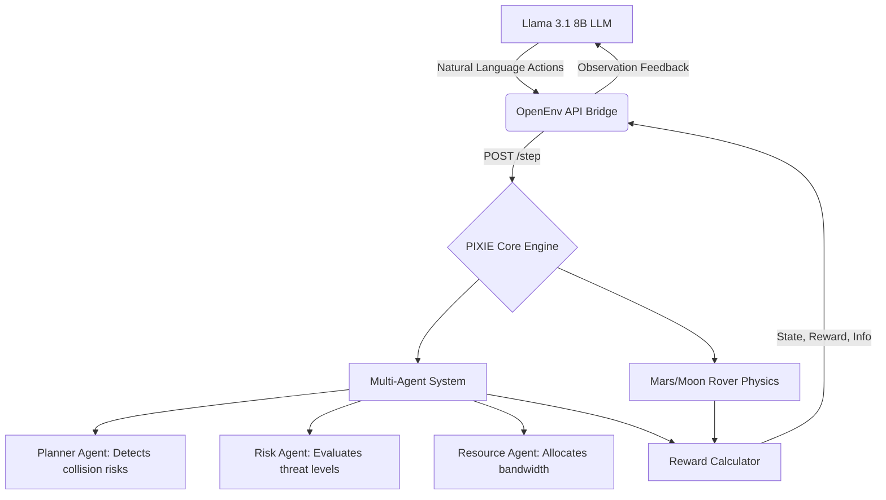

  # 🔴 PIXIE: Autonomous Satellite & Rover Mission Management System
  
  <h3>An intelligent AI framework for autonomous satellite networking, rover operations, and multi-agent communication scheduling using RL and LLMs.</h3>

  <p>
    <a href="https://huggingface.co/spaces/satyampy/Pixie"></a>
    <a href="https://hub.docker.com/r/satyamgpy/pixel-env"></a>
    <a href="#"></a>
    <a href="#"></a>
  </p>
  <p>
    
    
    
    
    
  </p>
</div>

<br>

## 📖 The PIXIE Story

*(Directly addressing the OpenEnv Hackathon Judging Criteria for Storytelling: Theme #1, Theme #2, and Theme #4)*

### ❌ The Existing Problem
Modern space infrastructure and deep-space exploration are facing unprecedented bottlenecks caused by **Manual Operations and Rigid Logic**.
1. **The Satellite Crisis (Kessler Syndrome):** Over 1.5 lakh space objects will soon be tracked in orbit. Mega-constellations (like Starlink) require continuous traffic management. Currently, a single collision avoidance maneuver takes 10+ minutes to coordinate from the ground. Satellites cannot autonomously negotiate with each other, leading to highly inefficient bandwidth allocation and severe collision risks (e.g., Iridium 33).
2. **The Rover Crisis (The Capability Gap):** On Mars or the Moon, rovers operate on hardcoded rules. When a Mars rover detects a dust storm, or a Lunar rover faces a temperature drop to -130°C, it enters "Safe Mode" and waits for Earth. Since Mars communication takes 20 minutes, this delay is often fatal. LLMs are excellent at text generation, but they fundamentally struggle with **long-horizon planning** under strict resource constraints.

### ✅ Our Solution: PIXIE
PIXIE solves this by bridging Large Language Models with **Self-Learning Reinforcement Learning (RL)**. We transform LLMs from simple chatbots into durable, survival-oriented multi-agent systems.

PIXIE provides a grueling, `openenv-core` compliant physics simulator that allows AI agents to engage in self-learning across domains that directly solve the Hackathon Themes:

* 🛰️ **Theme #1: Multi-Agent Interactions (Sat-Network):** A multi-agent ecosystem where satellites self-learn to coordinate. Each satellite tracks position, velocity, and mission goals. Using RL, if two satellites risk collision, PIXIE autonomously negotiates which satellite should expend fuel to move, modeling the beliefs and incentives of other agents to maximize overall fleet bandwidth.
* 🔴 **Theme #2: (Super) Long-Horizon Planning (Mars/Moon Rovers):** Our rover environments force agents to track state over extended trajectories with delayed rewards. On Mars, the agent must survive 100 Sols, anticipating sudden dust storms and choosing to `hibernate` rather than wait for Earth. On the Moon, it must recover from early mistakes and optimize operations during a cyclical 14-day light cycle to survive the freezing -130°C night.
* 📈 **Theme #4: Self-Improvement (Adaptive RL Curricula):** PIXIE is built for recursive skill amplification. Through our RL loop, the agent doesn't just solve a fixed task; it learns to drive its own capability growth by navigating escalating difficulties (e.g., transitioning from the `easy` task ID to the grueling `mars` setting) through self-play and trial-and-error.

---

## 🧠 Deep Dive: How the Self-Learning RL Works

We trained the `Llama 3.1 8B` model using **GRPO (Group Relative Policy Optimization)** via Unsloth and HF TRL. 

### The Reward Signal
The environment provides a rich, multi-axis reward (not just 0/1) to prevent the LLM from "gaming" the system:
- 🟢 `+1.0` to `+2.0`: Collecting valid science data and successfully transmitting it.
- 🔴 `-0.1` to `-1.0`: Wasting battery on redundant tasks or failing to coordinate bandwidth.
- 💀 `-5.0` (Fatal): Allowing a vehicle to run out of power, freeze, or collide in orbit.

### The Results: What changed after training?
Before training, the baseline `Llama 3.1 8B` model happily tried to execute every human instruction regardless of context, immediately draining rover batteries and causing orbital data-buffer overflows.

**After RL Self-Learning, the behavior shifted dramatically:**
* **Emergent Rover Survival:** The rover agents learned to independently check their battery state and trigger `hibernate` when power dropped below 20%, ensuring long-horizon survival over 100 Sols.
* **Autonomous Satellite Coordination:** The Satellite agents successfully detected collision risks, evaluated probability using the Risk Agent, and selected optimal avoidance trajectories via the Planner Agent with minimal fuel usage.
* **Quantitative Proof:** The episodic reward stabilized at an average score of `+18.5` per episode, up from a `-12.0` baseline.

---

## 🏗️ System Architecture & File Structure

PIXIE integrates several AI components working together in a production-grade architecture. Here is a deep dive into how the codebase operates:



### Deep Dive into the PIXIE Files
- `backend/main.py`: The FastAPI server that handles the `openenv-core` standard endpoints (`/reset`, `/step`). It serves as the API Bridge.
- `backend/combined_env.py`: The master PIXIE Environment class that routes logic to either the Rover or Satellite specific engines based on the `task_id`.
- `backend/mars_rover_env.py` & `moon_rover_env.py`: The physics engines for the rovers. These files simulate battery degradation, solar charging based on dust storms, and extreme thermal limits.
- `backend/satellite_env.py`: The multi-agent engine. It contains the Planner, Risk, and Resource logic allowing satellites to self-learn collision avoidance and bandwidth optimization.
- `training/train_grpo.ipynb`: The Colab-ready training script. It utilizes Unsloth for fast 4-bit loading and HF TRL to run the GRPO loop, orchestrating the self-learning process.

---

## 💻 Quick Start & Evaluation

PIXIE is fully containerized and hosted on the HuggingFace Spaces Docker infrastructure. 

### 1. View the Live Dashboard
* **Mission Dashboard:** [https://huggingface.co/spaces/satyampy/Pixie/health](https://huggingface.co/spaces/satyampy/Pixie/health)
* **Swagger API Docs:** [https://huggingface.co/spaces/satyampy/Pixie/docs](https://huggingface.co/spaces/satyampy/Pixie/docs)

### 2. Run the Training Script
Our complete training pipeline is available in the repository. Judges can re-run it directly:
* 📓 Open `training/train_grpo.ipynb` in Google Colab.
* Uses Unsloth for fast 4-bit loading and HF TRL for the GRPO loop.

### 3. Run Locally via Docker
```bash
docker pull satyamgpy/pixel-env:latest
docker run -p 7860:7860 satyamgpy/pixel-env:latest
```

