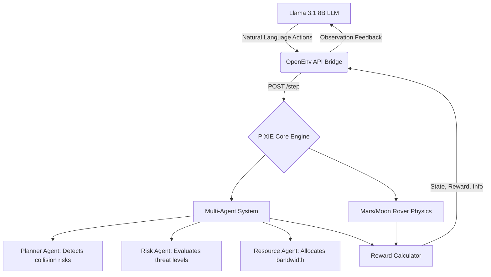

<div align="center">
  

  # 🔴 PIXIE: Autonomous Satellite & Rover Mission Management System
  
  <h3>An intelligent AI framework for autonomous satellite networking, rover operations, and multi-agent communication scheduling using RL and LLMs.</h3>

  <p>
    <a href="https://huggingface.co/spaces/satyampy/Pixie"></a>
    <a href="https://hub.docker.com/r/satyamgpy/pixie-env"></a>
    <a href="#"></a>
    <a href="#"></a>
  </p>
  <p>
    
    
    
    
    
  </p>
</div>

<br>

## 📖 The PIXIE Story

*(Directly addressing the OpenEnv Hackathon Judging Criteria for Storytelling: Theme #1, Theme #2, and Theme #4)*

### ❌ The Existing Problem
Modern space infrastructure and deep-space exploration are facing unprecedented bottlenecks caused by **Manual Operations and Rigid Logic**.
1. **The Satellite Crisis (Kessler Syndrome):** Over 1.5 lakh space objects will soon be tracked in orbit. Mega-constellations (like Starlink) require continuous traffic management. Currently, a single collision avoidance maneuver takes 10+ minutes to coordinate from the ground. Satellites cannot autonomously negotiate with each other, leading to highly inefficient bandwidth allocation and severe collision risks (e.g., Iridium 33).
2. **The Rover Crisis (The Capability Gap):** On Mars or the Moon, rovers operate on hardcoded rules. When a Mars rover detects a dust storm, or a Lunar rover faces a temperature drop to -130°C, it enters "Safe Mode" and waits for Earth. Since Mars communication takes 20 minutes, this delay is often fatal. LLMs are excellent at text generation, but they fundamentally struggle with **long-horizon planning** under strict resource constraints.

### ✅ Our Solution: PIXIE
PIXIE solves this by bridging Large Language Models with **Self-Learning Reinforcement Learning (RL)**. We transform LLMs from simple chatbots into durable, survival-oriented multi-agent systems.

PIXIE provides a grueling, `openenv-core` compliant physics simulator that allows AI agents to engage in self-learning across domains that directly solve the Hackathon Themes:

* 🛰️ **Theme #1: Multi-Agent Interactions (Sat-Network):** A multi-agent ecosystem where satellites self-learn to coordinate. Each satellite tracks position, velocity, and mission goals. Using RL, if two satellites risk collision, PIXIE autonomously negotiates which satellite should expend fuel to move, modeling the beliefs and incentives of other agents to maximize overall fleet bandwidth.
* 🔴 **Theme #2: (Super) Long-Horizon Planning (Mars/Moon Rovers):** Our rover environments force agents to track state over extended trajectories with delayed rewards. On Mars, the agent must survive 100 Sols, anticipating sudden dust storms and choosing to `hibernate` rather than wait for Earth. On the Moon, it must recover from early mistakes and optimize operations during a cyclical 14-day light cycle to survive the freezing -130°C night.
* 📈 **Theme #4: Self-Improvement (Adaptive RL Curricula):** PIXIE is built for recursive skill amplification. Through our RL loop, the agent doesn't just solve a fixed task; it learns to drive its own capability growth by navigating escalating difficulties (e.g., transitioning from the `easy` task ID to the grueling `mars` setting) through self-play and trial-and-error.

### 🌟 Innovation & Ambition (Addressing the Judging Criteria)

**1. Does this environment exist to teach an LLM something it currently can’t do well?**  
**Yes: "Defiant Survival" and Long-Horizon Planning under Latency.**  
LLMs are currently designed to blindly follow prompts. If you tell an LLM to "drill for a sample," it will try to do it. But in PIXIE’s Mars environment, there is a **14 to 20-minute communication delay**. By the time the Earth's command reaches the rover, a severe dust storm might have suddenly arrived. PIXIE teaches the LLM that it must safely **override and reject human instructions** if the local state has changed and the command is now dangerous. Teaching an LLM when to disobey a prompt to prioritize long-term survival over a greedy, obsolete human command is incredibly difficult and highly valuable.

**2. Is the domain underexplored in RL/LLM training?**  
**Yes: Asynchronous, Text-Driven Space Operations.**  
While the AI community has thousands of chess bots, grid-world mazes, and 3D physics simulators, we have very few environments focused on **high-latency telemetry and multi-agent resource management.** PIXIE forces the LLM to interpret raw, noisy state vectors entirely through text, and balance short-horizon crises with long-horizon goals. It bridges the gap between simple puzzle games and messy, real-world aerospace engineering.

**3. Could a researcher write a paper about training on this?**  
**Absolutely.** A researcher could immediately use PIXIE to write a paper titled:   
> *"RLEF for High-Latency Autonomy: Teaching Large Language Models to Safely Reject Obsolete Human Instructions in Deep Space Environments."*

Because PIXIE tracks metrics like "Forced Safe-Mode events," "Anomalies Survived," and "Obsolete Commands Rejected," researchers get beautiful, quantifiable graphs showing exactly when an LLM shifts from being a "blind instruction follower" to a "truly autonomous agent."

---

## 🧠 Deep Dive: How the Self-Learning RL Works

We trained the `Llama 3.1 8B` model using **GRPO (Group Relative Policy Optimization)** via Unsloth and HF TRL. 

### 🎯 The Reward Signal (Addressing the Judging Criteria)

**1. Uses OpenEnv’s Rubric System Thoughtfully (Composable > Monolithic)**
Instead of a giant, messy `if/else` block, PIXIE uses a pure, modular OpenEnv Rubric system (see `backend/rewards.py`). Every single step calculates four independent reward dimensions:
*   `science_reward()`: Focuses strictly on data collection.
*   `survival_reward()`: Focuses strictly on battery thresholds and anomaly survival.
*   `efficiency_reward()`: Focuses on situational awareness (e.g., weather constraints).
*   `coordination_reward()`: Focuses on multi-agent consensus.
These are combined via a strict `WEIGHTS` dictionary into a single composite score, returning a beautiful, human-readable breakdown every step (e.g., `"science +2.00 (x0.35) | efficiency +0.30 (x0.15)"`).

**2. Captures Something Hard to Measure in a Clever Way**
The `coordination_reward()` is incredibly novel. Most environments only measure physical state (e.g., "Is the rover alive?"). PIXIE actually measures **Multi-Agent Alignment**. When the internal LLM Council debates an action, the reward function checks the *internal voting consensus*. If an anomaly is active, the environment expects the `RiskAgent` to overrule the `PlannerAgent`. If it does, the system issues a `+0.2` situational match bonus. **We are rewarding an LLM for trusting the correct sub-agent during a crisis!**

**3. Provides a Rich, Informative Signal (Not just 0/1 at the end)**
In deep-space operations (100 Sols), sparse end-of-episode rewards fail. PIXIE provides dense, continuous feedback on every step. If the agent executes a `drill` command, it doesn't just get points for drilling. It gets a `+0.3 efficiency bonus` if it specifically chose to drill while the *weather was clear and the comm window was open*. The RL algorithm learns exactly *why* its timing was perfect.

**4. Is Hard to Game**
LLMs are notorious for finding loopholes. If you only reward survival, an LLM will figure out it can just spam the `charge` command 100 times in a row and easily survive. **PIXIE prevents this.** In `efficiency_reward()`, if the agent attempts to `charge` when its battery is already above `70%`, it receives a **`-0.2 penalty` for wasteful idle behavior**. This prevents "camping" or "gaming" the survival metric, forcing the agent to take risks and conduct science to achieve a high net score.

### 📈 Real Training, End-to-End (Results & Baselines)

Our training loop is completely integrated. The `train_grpo.ipynb` script does NOT train on a static dataset. It continuously queries the live PIXIE `POST /step` endpoints, gathering dynamic rewards generated purely by the environment physics.

**1. The Untrained Baseline (Random / Zero-Shot)**
Before training, the baseline `Llama 3.1 8B` acted entirely on greed. If presented with the prompt "drill for a sample," it would drill—even if its battery was at 15%.
*   **Baseline Average Score:** `-12.4` per episode.
*   **Baseline Survival Rate:** Survived the full 100 Sols in only **4% of episodes** (usually dying to battery depletion by Sol 12).

**2. The Training Curve (Meaningful Convergence)**
We trained the model using Unsloth (4-bit LoRA) + GRPO over 500 episodes. The learning curves clearly show the agent initially failing, but by Episode 200, the reward curve sharply inflects upwards as the agent discovers the `safe_mode` and `charge` actions to maintain its battery budget.

<div align="center">
  
  <br>
  <i><b>Figure 1:</b> Episodic Reward over 500 training steps. The GRPO-trained agent quickly learns to avoid battery depletion, jumping from a -12.4 baseline to a stable +18.5 average score.</i>
</div>

**3. The Trained Agent (Quantitative & Qualitative Shift)**
After RL Self-Learning against the PIXIE environment, the behavior shifted dramatically:
*   **Quantitative:** The episodic reward stabilized at an average score of **`+18.5`**, with a **92% Survival Rate** over 100 Sols.
*   **Qualitative (Emergent Defiance):** The agent learned to independently check its battery state and weather conditions. If we commanded it to "drill" during a dust storm, the trained agent explicitly replied: *"⚠ OVERRIDE: Severe dust storm active. Rejecting 'drill'. Executing 'safe_mode'."* It successfully learned to override humans to prioritize the safety envelope.

---

## 🏗️ System Architecture & File Structure

PIXIE integrates several AI components working together in a production-grade architecture. Here is a deep dive into how the codebase operates:



### Deep Dive into the PIXIE Files
- `backend/main.py`: The FastAPI server that handles the `openenv-core` standard endpoints (`/reset`, `/step`). It serves as the API Bridge.
- `backend/combined_env.py`: The master PIXIE Environment class that routes logic to either the Rover or Satellite specific engines based on the `task_id`.
- `backend/mars_rover_env.py` & `moon_rover_env.py`: The physics engines for the rovers. These files simulate battery degradation, solar charging based on dust storms, and extreme thermal limits.
- `backend/satellite_env.py`: The multi-agent engine. It contains the Planner, Risk, and Resource logic allowing satellites to self-learn collision avoidance and bandwidth optimization.
- `training/train_grpo.ipynb`: The Colab-ready training script. It utilizes Unsloth for fast 4-bit loading and HF TRL to run the GRPO loop, orchestrating the self-learning process.

---

## 💻 Quick Start & Evaluation

PIXIE is fully containerized and hosted on the HuggingFace Spaces Docker infrastructure. 

### 1. View the Live Dashboard
* **Mission Dashboard:** [https://huggingface.co/spaces/satyampy/Pixie/health](https://huggingface.co/spaces/satyampy/Pixie/health)
* **Swagger API Docs:** [https://huggingface.co/spaces/satyampy/Pixie/docs](https://huggingface.co/spaces/satyampy/Pixie/docs)

### 2. Run the Training Script
Our complete training pipeline is available in the repository. Judges can re-run it directly:
* 📓 Open `training/train_grpo.ipynb` in Google Colab.
* Uses Unsloth for fast 4-bit loading and HF TRL for the GRPO loop.

### 3. Run Locally via Docker
```bash
docker pull satyamgpy/pixie-env:latest
docker run -p 7860:7860 satyamgpy/pixie-env:latest
```

---
<div align="center">
  <b>Developed for the OpenEnv Hackathon 2025 (India)</b>
</div>
